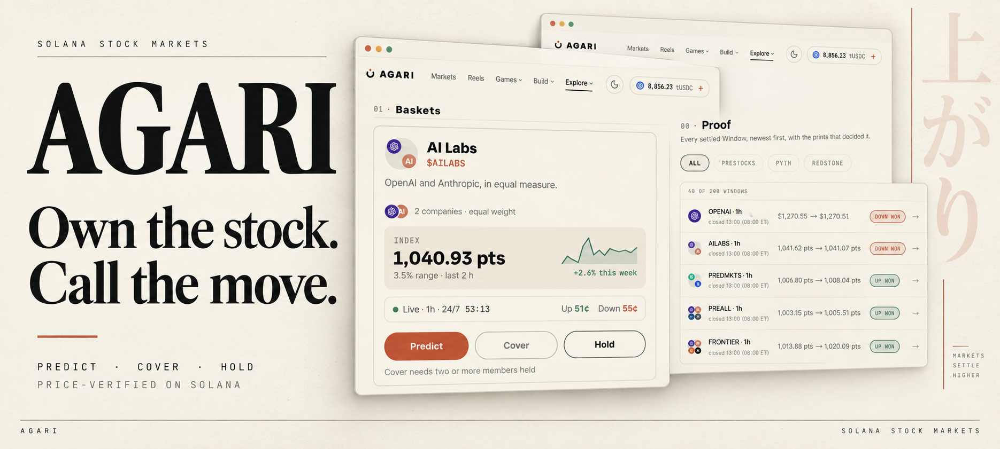
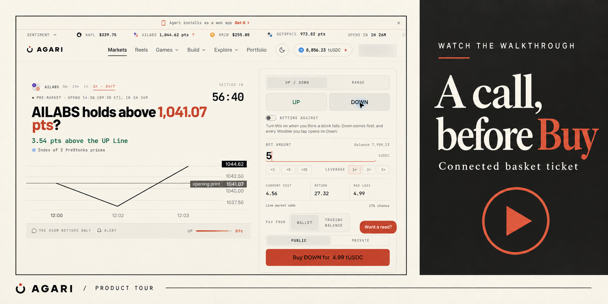
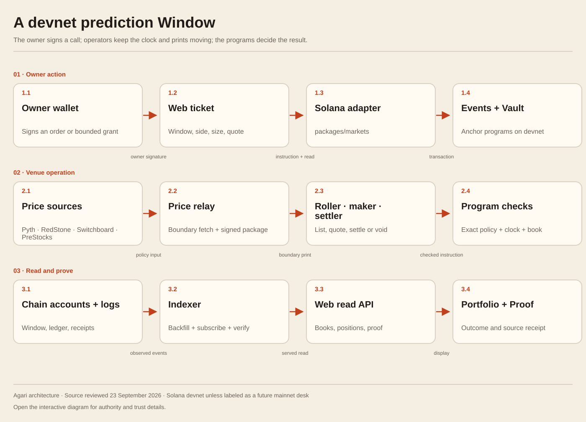
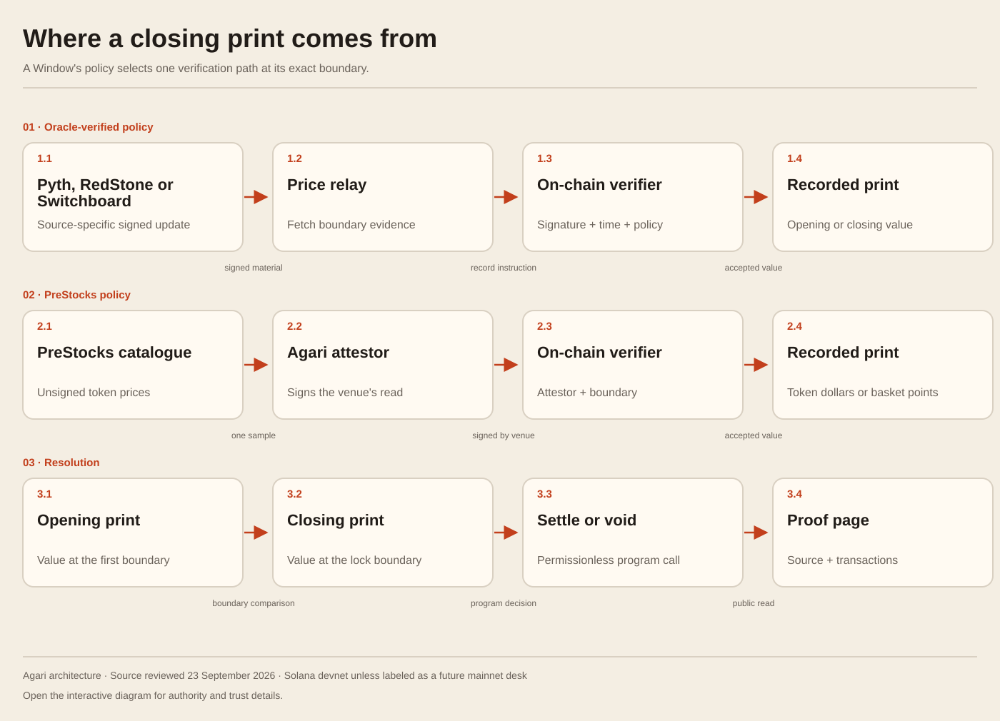
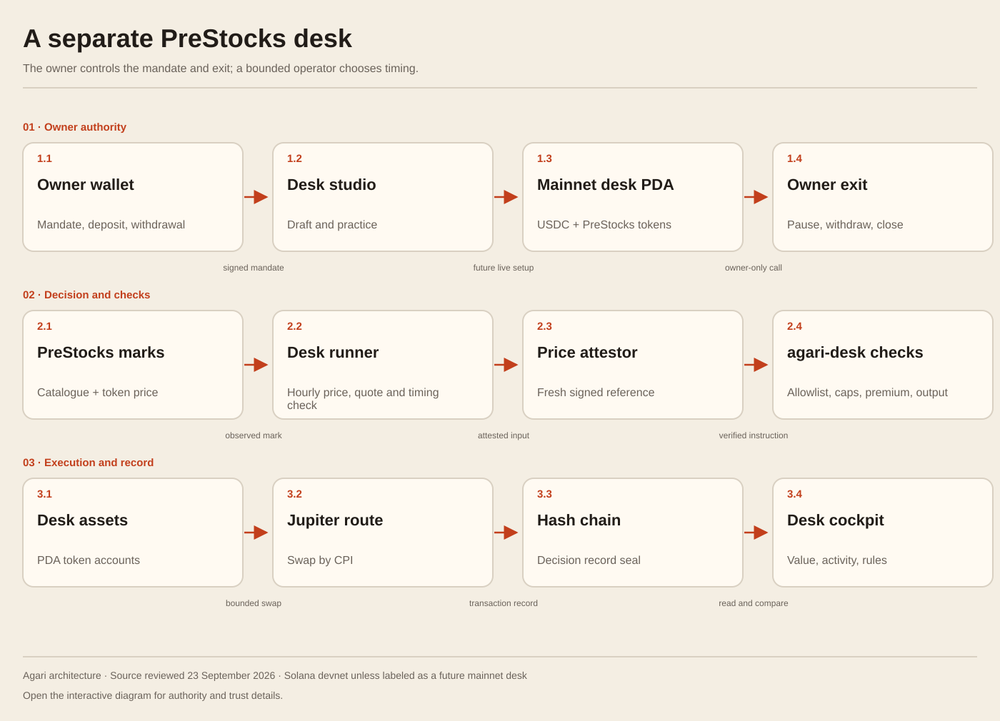

# Agari · 上がり

**Agari is an on-chain stock prediction exchange (DEX) on Solana.** Make an Up or Down call on a short price window, cover a tokenized stock you already hold, and inspect the price prints that settled the result. PreStocks powers an around-the-clock pre-IPO lane, five baskets, and a separate portfolio desk you can try with paper money.

[**Open Agari**](https://useagari.xyz) · [**Watch the product**](#watch-the-product) · [**See settlement proof**](https://useagari.xyz/proof) · [**Read the guides**](https://docs.useagari.xyz)

**Stocklana tracks:** [Main, Best Use of PreStocks, Best use of Pyth market data](https://hackathons.solana.com/hackathons/stocklana).

## The idea

Holding a stock and having a view on its next move are different decisions. Agari lets a holder keep the underlying token while making a short Down call as cover. Someone without a holding can make the same Up or Down call on a listed stock, a PreStocks name, or a basket. Every Window has a defined opening price, closing price, and settlement rule; [Proof](https://useagari.xyz/proof) makes the result inspectable.

Three ways in:

| Choose | What you do | Open it |
| --- | --- | --- |
| **Predict** | Trade an Up or Down contract in Agari's order-book venue. A correct call pays from the collateral locked in the Window. | [Markets](https://useagari.xyz/markets), [24/7 PreStocks baskets](https://useagari.xyz/baskets) |
| **Cover** | Connect a wallet holding a supported PreStocks token and see a Down call against that exposure. The holding stays in your wallet. | [Portfolio](https://useagari.xyz/portfolio), [portfolio guide](https://docs.useagari.xyz/trading/portfolio) |
| **Hold** | Choose PreStocks names, weights and spending limits; watch an hourly portfolio desk make recorded paper decisions against live prices and quotes. | [Desk](https://useagari.xyz/desk), [desk guide](https://docs.useagari.xyz/agents/desk) |

[Games](https://useagari.xyz/games) offer practice and arcade routes into the same market ideas. The exchange and desk are product paths in their own right.

**Networks at a glance:** Up/Down trading uses Solana **devnet tUSDC**, which has no real-money value. The portfolio desk runs in **paper practice**; its on-chain program and Jupiter trade path have been rehearsed on a Surfpool mainnet fork. [Availability](https://docs.useagari.xyz/help/availability) and [live status](https://useagari.xyz/status) show which paths can be used now.

## Try one Window

1. Browse [Markets](https://useagari.xyz/markets) or [Baskets](https://useagari.xyz/baskets) without a wallet. US-listed stock Windows follow exchange hours; PreStocks and basket Windows run around the clock when their price source is available.
2. For an order, connect a **Solana devnet** wallet, choose **Get test funds**, then read the Window's source, live quote, cost and maximum loss before choosing Up or Down. [First trade guide](https://docs.useagari.xyz/trading/first-trade).
3. After it closes, open [Proof](https://useagari.xyz/proof) to inspect the opening and closing prints, result, source and transaction links.

## Watch the product

[Play the connected basket ticket](docs-site/public/videos/connected-basket-ticket-2026-09-23.mp4) · [See a portfolio walkthrough](docs-site/public/videos/connected-portfolio-2026-09-23.mp4) · [See a practice desk walkthrough](docs-site/public/videos/connected-practice-desk-2026-09-23.mp4) · [Open the app's demo and transaction table](https://useagari.xyz/demo)

These short screen recordings show the connected app through a quote preview or paper-desk read; they do not show a newly signed Buy. The banner and cover are editorial compositions based on these dated app screens. The [capture provenance](docs-site/public/captures/provenance-connected-2026-09-23.json) names the routes and states. On-chain transactions are linked below and in the [evidence ledger](docs/evidence/acceptance.md).

## Why the integrations matter

| Track | What a user sees | What the integration actually does | Verify it |
| --- | --- | --- | --- |
| **Main** | A live Up/Down exchange, wallet-controlled orders, result and claim pages. | Solana programs hold test collateral, match calls, admit price prints, settle or void Windows, and pay claims. Operators can submit evidence but cannot choose a winner outside the registered rule. | [First trade](https://docs.useagari.xyz/trading/first-trade) · [event program](anchor/programs/agari-events) · [settled claim](https://explorer.solana.com/tx/3VFzTVV7FJkaksFDrQtsuJFfaT437SKBx6Gwd93fPLnken3Fuv7tDjpYNq3rA5nQtTKppincNuwWWoDhcJR1SURg?cluster=devnet) |
| **PreStocks** | An OpenAI 24/7 Window, five equal-weight baskets, a holder cover, pre-IPO facts, and a practice desk. | Agari reads PreStocks token prices and marks from its catalogue. Its own attestor signs the boundary read used for pre-IPO settlement. The desk checks a buy against the PreStocks mark and the owner's price ceiling. Every pre-IPO asset integrated here comes from PreStocks. | [Integration guide](https://docs.useagari.xyz/architecture/prestocks-and-pyth) · [price adapter](packages/markets/src/prices/prestocks.ts) · [AI Labs basket settlement](https://explorer.solana.com/tx/5xkJKmS47fZBYRNyeJ83iffHTxzpE2vMr9SGBMvKb3eeN6wNh1xC3WeWYpknWAynR1mAjmKF2ZpVEWwRU3RuZm3f?cluster=devnet) |
| **Pyth** | TSLA, QQQ and VOO Windows whose settlement is tied to a verifiable market price. | The relay gets a Pyth pull update for the Window boundary. The program checks its feed, verification level, time and confidence on chain. TSLA also cross-checks RedStone; an excessive disagreement voids the Window. | [Price-source guide](https://docs.useagari.xyz/architecture/price-sources) · [on-chain verifier](anchor/programs/agari-events/src/instructions/record_print_sources.rs) · [TSLA settlement](https://explorer.solana.com/tx/xjKyBjRk51GitA35CZoP6fKd9huZ15EMH5RPmv8Lkj6XCKYn71zUDFfJaQPHyyresAX4Es13UCFGs4GSogvmzwt?cluster=devnet) · [divergence void](https://explorer.solana.com/tx/24R75m6PE6NohCTE1Z6t3oQvReGP628DVdUsEMM3kKs7gHFWmhTeA32QUKvJEWeWeUW8VzN8VSdQo2rrkCebHYaj?cluster=devnet) |

PreStocks catalogue prices are **venue-attested**, while the Pyth path verifies a **Pyth update on chain**. They are different trust paths. The [track notes](docs/submission/tracks.md) explain each one with more code and transaction links. [Status](https://useagari.xyz/status) reports source availability at the time you visit.

## Follow the result

The [architecture guide](https://docs.useagari.xyz/architecture/overview) explains the actors and authority boundaries. These diagrams are generated from [architecture.json](docs-site/lib/architecture.json).

See where the price prints come from

See how the portfolio desk is bounded

For a concrete result, follow the [first AI Labs basket settlement](https://explorer.solana.com/tx/5xkJKmS47fZBYRNyeJ83iffHTxzpE2vMr9SGBMvKb3eeN6wNh1xC3WeWYpknWAynR1mAjmKF2ZpVEWwRU3RuZm3f?cluster=devnet), the [TSLA Pyth settlement](https://explorer.solana.com/tx/xjKyBjRk51GitA35CZoP6fKd9huZ15EMH5RPmv8Lkj6XCKYn71zUDFfJaQPHyyresAX4Es13UCFGs4GSogvmzwt?cluster=devnet), or a [TSLA Window voided on price disagreement](https://explorer.solana.com/tx/24R75m6PE6NohCTE1Z6t3oQvReGP628DVdUsEMM3kKs7gHFWmhTeA32QUKvJEWeWeUW8VzN8VSdQo2rrkCebHYaj?cluster=devnet). The [selected evidence ledger](docs/evidence/acceptance.md) dates these devnet receipts and separates them from the 31-check desk rehearsal on a mainnet fork.

## Run it locally

Use **Node.js 22+** and **pnpm 11.24.0**.

    pnpm install --frozen-lockfile
    pnpm dev

Open [localhost:3000](http://localhost:3000). Public market reads and the app shell start without a local environment file. Wallet-funded actions and always-on services need the provider and role configuration described in [.env.example](.env.example), [web/.env.example](web/.env.example) and the [local setup guide](https://docs.useagari.xyz/builders/local-setup). Do not commit filled environment files or role keys.

    pnpm typecheck
    pnpm invariants
    pnpm test
    pnpm build

The documentation is a separate app in [docs-site](docs-site): run the install and dev commands there for [localhost:3153](http://localhost:3153), or run its content, type and build checks with pnpm check.

## Find the code and documentation

| Looking for | Start here |
| --- | --- |
| User journeys, source definitions and trust boundaries | [Documentation](https://docs.useagari.xyz), [builder source map](https://docs.useagari.xyz/builders/source-map), [price sources](https://docs.useagari.xyz/architecture/price-sources) |
| The exchange and desk programs | [Anchor programs](anchor/programs) |
| Price adapters, market rules and basket calculation | [Market package](packages/markets), [core package](packages/core) |
| Rollers, price relay, settler, indexer and desk runner | [Operations service](services/ops) |
| App screens and proof UI | [Web app](web) |
| A text index for automated readers | [llms.txt](https://docs.useagari.xyz/llms.txt), [full guide text](https://docs.useagari.xyz/llms-full.txt) |

Agari is maintained by **Abubakr Jimoh** and [MIT licensed](LICENSE). [Third-party notices](THIRD_PARTY_NOTICES.md) cover material with separate terms.
