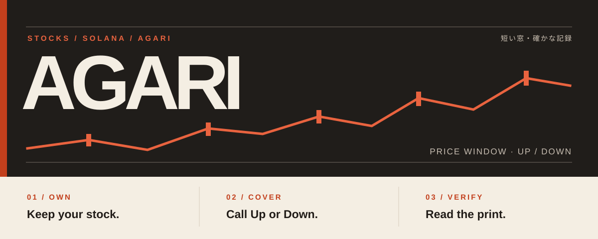
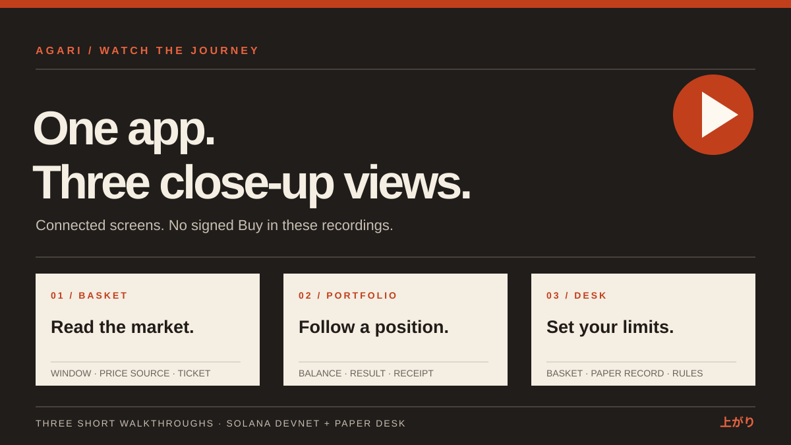

# Agari · 上がり

**Own the stock. Call the move.** Agari lets people make short Up or Down calls on stock prices, cover a tokenized holding without selling it, and inspect the price print that decided the result. It runs on Solana. The prediction venue uses **devnet test money (tUSDC)**; the separate PreStocks desk is available in paper practice and has been rehearsed on a mainnet fork.

[Open the app](https://useagari.xyz) · [Read the guides](https://docs.useagari.xyz) · [See settled proof](https://useagari.xyz/proof) · [Check status](https://useagari.xyz/status)

**Stocklana entries:** [Main track, Best Use of PreStocks, and Best use of Pyth market data](https://hackathons.solana.com/hackathons/stocklana). The main track asks for a real user, a working end-to-end demo, a reason to use Solana, and execution quality. Agari focuses on a holder who wants to express a short view or protect a position while keeping the underlying token.

## Try Agari

1. Open [Markets](https://useagari.xyz/markets) or [Baskets](https://useagari.xyz/baskets). Browsing needs no wallet. US stock Windows follow exchange hours; the OpenAI PreStocks lane and five PreStocks baskets run around the clock when their price source is available.
2. Connect a devnet wallet and use **Get test funds**. A Window is one timed Up or Down round. Read its price source and available book before placing a call.
3. After a Window resolves, open [Proof](https://useagari.xyz/proof). The result links to recorded opening and closing prices, their source, and the Solana transactions.

A holder can also open [Portfolio](https://useagari.xyz/portfolio) for a Down cover suggestion based on connected PreStocks tokens. The [desk](https://useagari.xyz/desk) lets a user draft a basket mandate and see paper decisions; it does not move mainnet funds today.

## Watch the walkthrough

[Watch the basket walkthrough](https://docs.useagari.xyz/trading/baskets) · [Portfolio walkthrough](https://docs.useagari.xyz/trading/portfolio) · [Desk walkthrough](https://docs.useagari.xyz/agents/desk) · [App demo and transaction table](https://useagari.xyz/demo)

These dated recordings show connected product screens and stop before a signed Buy. A full owner-run transaction video is still pending. The app's demo page keeps transaction evidence available in the meantime.

## Why these tracks fit

| Track | What the integration does | Follow it |
| --- | --- | --- |
| **Main** | An on-chain order book matches calls; Solana programs hold collateral, verify prints, settle or void, and pay claims. Wallet signatures and bounded grants control spending. | [Venue diagram](#how-agari-works), [first trade guide](https://docs.useagari.xyz/trading/first-trade), [devnet receipts](docs/evidence/acceptance.md) |
| **PreStocks** | Agari reads the [PreStocks catalogue](https://prestocks.com/api/prestocks) for the OpenAI 24/7 token-price lane, holder cover suggestions, five basket indices, pre-IPO facts and the desk's price ceiling. Each boundary read is signed by Agari's attestor; the catalogue itself is unsigned. No other pre-IPO issuer is integrated. | [Integration guide](https://docs.useagari.xyz/architecture/prestocks-and-pyth), [source adapter](packages/markets/src/prices/prestocks.ts), [basket rules](packages/core/src/market/baskets.ts), [AI Labs settlement](https://explorer.solana.com/tx/5xkJKmS47fZBYRNyeJ83iffHTxzpE2vMr9SGBMvKb3eeN6wNh1xC3WeWYpknWAynR1mAjmKF2ZpVEWwRU3RuZm3f?cluster=devnet) |
| **Pyth** | A TSLA, QQQ or VOO Window can settle only after the [Pyth pull update](https://docs.pyth.network/price-feeds/core/pull-updates) for its exact boundary passes the event program's checks. TSLA also cross-checks RedStone and voids on excessive divergence. The relay obtains updates from Hermes; [Proof](https://useagari.xyz/proof) exposes the recorded source. | [Verifier](anchor/programs/agari-events/src/instructions/record_print_sources.rs), [relay](services/ops/src/actors/price-relay/hermes-fetch.ts), [TSLA settlement](https://explorer.solana.com/tx/xjKyBjRk51GitA35CZoP6fKd9huZ15EMH5RPmv8Lkj6XCKYn71zUDFfJaQPHyyresAX4Es13UCFGs4GSogvmzwt?cluster=devnet), [divergence void](https://explorer.solana.com/tx/24R75m6PE6NohCTE1Z6t3oQvReGP628DVdUsEMM3kKs7gHFWmhTeA32QUKvJEWeWeUW8VzN8VSdQo2rrkCebHYaj?cluster=devnet) |

**Pyth access boundary:** The OpenAI and Anthropic valuation-index paths are implemented but their feeds return a 403 for the current trial key, so those valuation Windows are not listed. The existing Pyth trial policies for TSLA, QQQ and VOO end at the 25 September 2026 market close; [Status](https://useagari.xyz/status) is the live availability check. [Track evidence](docs/submission/tracks.md) explains the implementation and open gates in more detail.

### A few receipts

| Action | Result |
| --- | --- |
| [Open an OpenAI Window](https://explorer.solana.com/tx/2PTZDJ5yY9oEmJKCQUcdNrweZj5qPnx3veo2BvBrsbSnMjxkntwh21rP5S4o3fUpjZCV3sKHVzN6AA9AKr3so1dH?cluster=devnet) and [record its opening print](https://explorer.solana.com/tx/4TJTb2gTRkpg6p3HHG7WDKRYcTdzLxyz3zC23dLNF3zLUZksP12DB3B2yiixYq96WZTHHmmfGEfsAUN3j5yCXwPT?cluster=devnet) | PreStocks lane operated on devnet |
| [Settle a TSLA Window](https://explorer.solana.com/tx/xjKyBjRk51GitA35CZoP6fKd9huZ15EMH5RPmv8Lkj6XCKYn71zUDFfJaQPHyyresAX4Es13UCFGs4GSogvmzwt?cluster=devnet) | Pyth boundary prints and RedStone cross-check determined Up |
| [Void a divergent TSLA Window](https://explorer.solana.com/tx/24R75m6PE6NohCTE1Z6t3oQvReGP628DVdUsEMM3kKs7gHFWmhTeA32QUKvJEWeWeUW8VzN8VSdQo2rrkCebHYaj?cluster=devnet) | The program refused to pick a winner from conflicting prices |
| [Redeem a settled call](https://explorer.solana.com/tx/3VFzTVV7FJkaksFDrQtsuJFfaT437SKBx6Gwd93fPLnken3Fuv7tDjpYNq3rA5nQtTKppincNuwWWoDhcJR1SURg?cluster=devnet) | The on-chain seat paid its recorded entitlement |

The [public evidence ledger](docs/evidence/acceptance.md) contains the dated transaction history, including failed attempts and the 31-check desk rehearsal on a **Surfpool mainnet fork**. A fork receipt is not a mainnet transaction.

## How Agari works

The diagrams below are rendered SVGs from [Agari's architecture map](docs-site/lib/architecture.json). The [interactive documentation](https://docs.useagari.xyz/architecture/overview) adds the authority and trust details behind each step.

Where the price print comes from

Pyth, RedStone and Switchboard use their own verification rules. PreStocks token and basket prices are catalogue reads signed by Agari's attestor. A missing or invalid required print can void a Window.

How the separate desk is bounded

The owner chooses assets and limits. A runner can propose actions; the desk program checks allowed names, caps, price reference and output before a swap. The owner alone may withdraw. The program has passed a fork rehearsal, and mainnet deployment is pending.

The web app reads public markets without a wallet. Orders use a wallet signature or a user-authorized [Trading Balance grant](https://docs.useagari.xyz/trading/tap-trading). Off-chain operators keep Windows, prices and quotes moving; they do not own the user's private key. The chain holds the market result and money rules.

## Run locally

Use **Node.js 22+** and **pnpm 11.24.0**.

~~~sh
pnpm install --frozen-lockfile
pnpm dev
~~~

Open [localhost:3000](http://localhost:3000). The public app shell and market reads start without a local environment file. Funded actions, AI, social routes, and always-on actors need provider and role configuration from [.env.example](.env.example), [web/.env.example](web/.env.example), and the [local setup guide](https://docs.useagari.xyz/builders/local-setup). Keep filled environment files and role keys outside Git.

~~~sh
pnpm typecheck
pnpm invariants
pnpm test
pnpm build
~~~

The docs site is in [docs-site](docs-site). To run it, install its dependencies there and run its own dev script on [localhost:3153](http://localhost:3153). Its content check, typecheck and build are grouped as `pnpm check` from that directory.

## Repository map

| Path | Purpose |
| --- | --- |
| [anchor/programs](anchor/programs) | Solana programs for the event venue, vault, reserves, strategies, games and desk |
| [packages/core](packages/core) | Market rules, calendars, basket arithmetic and types |
| [packages/markets](packages/markets) | Solana transaction and price-source integration |
| [services/ops](services/ops) | Roller, price relay, maker, settler, indexer and other operators |
| [web](web) | App, market screens and proof pages |
| [docs-site](docs-site) | Public guides, diagrams, captures and walkthroughs |
| [docs/evidence](docs/evidence) | Dated transaction evidence |

## Current limits

Agari's prediction collateral is **devnet tUSDC**, with no real-money value. The PreStocks desk's paper flow is usable; its program has been exercised only on a mainnet fork, and no real-money desk is deployed. The programs have no external security audit. Source availability and quote depth can change; check [Status](https://useagari.xyz/status) before using a lane. The [availability guide](https://docs.useagari.xyz/help/availability) separates deployed, gated and paper-only paths.

Agari is maintained by **Abubakr Jimoh**. The code is [MIT licensed](LICENSE); [third-party notices](THIRD_PARTY_NOTICES.md) describe material with its own terms.
